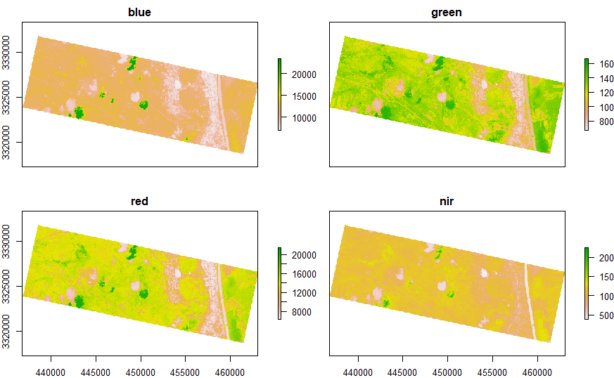
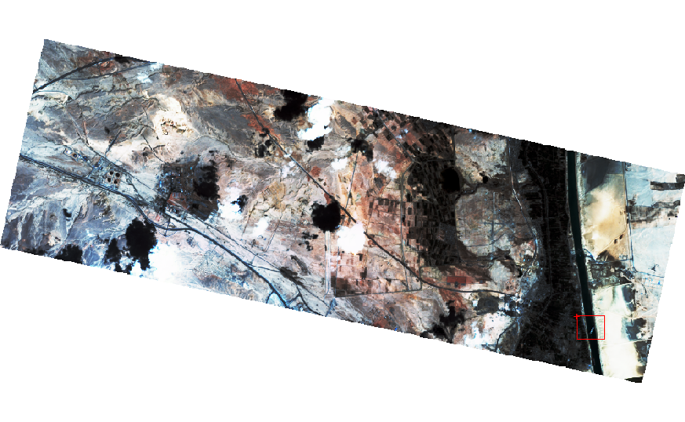
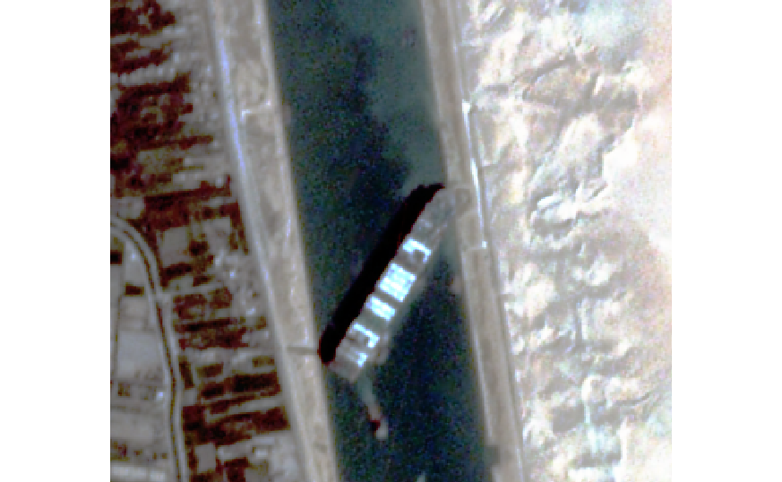

# PlanetScope-Ever-Green-Ship

# Explore up-to-date high resolution 4-band PlanetScope 
## Ever Green Ship bloackage event

## EverGreen Ship
### Location: Suez Canal, Egypt
### Image: 4-band PlanetScope 
### Resolution: 3 m
### Provider: Planet Lab
### Thanks to Planet Lab for the data for Education and Research Program

## 1. Load library
```
library(raster)
```

## 2. Read High-resolution 4-band PlanetScope data
```
suez_canal = stack("20210325_081016_1011_3B_AnalyticMS.tif")
```

## 3. Plot 4-band
```
plot(suez_canal)
```
<!-- -->


```
# ever_green[[1]] # Blue
# ever_green[[2]] # Green
# ever_green[[3]] # Red
# ever_green[[4]] # NIR
```

## 4. Plot RGB
```
plotRGB(suez_canal,
        r = 3, g = 2, b = 1,
        stretch = "hist",
        legend = FALSE,
        axes = FALSE,
        box = FALSE)
```
<!-- -->


## 5. Draw extent
```
e <- drawExtent()
```
<!-- -->

## 6. Crop by the drawn extent
```
cropped_suez_canal <- crop(suez_canal,e)
```

## 7. Plot result
```
plotRGB(cropped_suez_canal,
        r = 3, g = 2, b = 1,
        stretch = "hist",
        legend = FALSE,
        axes = FALSE,
        box = FALSE)
```

<!-- -->
